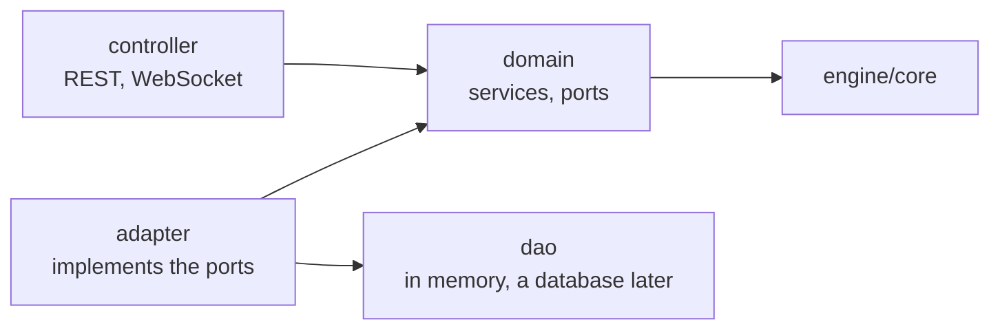

# Shardbound

An invented 1v1 card game, built as a testbed for AI engineering: a rules Arbiter (RAG and LoRA), an MCP coach agent, AI opponents and a rigorous evaluation bench. No language model can know the rules of an invented game, so every correct answer must come from retrieval or fine-tuning, and the engine computes the ground truth to grade them. Full plan: [`docs/design.md`](docs/design.md).

## Run it

```bash
docker compose up --build
```

Then open http://localhost:4200 and play against the bot, or create a game against a human and send the invite link.

Without Docker (Java 21, Node 24):

```bash
cd engine && ./mvnw -pl api -am spring-boot:run   # game server, http://localhost:8080
cd frontend && npm install && npm start           # client, http://localhost:4200
```

Tests: `cd engine && ./mvnw verify`, `cd frontend && npm test`.

## Repository

| Path | What |
|---|---|
| `docs/` | Design document and rulebook ([`docs/rules/`](docs/rules/README.md)) |
| `content/` | Cards and decks as JSON, with their schemas and tests |
| `engine/core` | The rules engine: Java 21, no framework |
| `engine/api` | The game server: Spring Boot, REST and WebSocket |
| `frontend/` | The test client: Angular |

## Backend architecture

**`engine/core` is a pure library.** Immutable game states; `apply(state, action)` returns the new state and the events that led to it, each with the IDs of the rules applied. Players, human or bot, answer with the index of one of the legal actions the engine lists.

**`engine/api` is the game server**, in layers that only call downwards (checked by an ArchUnit test):



The domain knows neither persistence nor transport. No server instance keeps a game in memory: every move is saved with an optimistic lock, and a small notification tells the other instances that the game moved, so it can run on several instances.

## Status

Rules, 39 cards and three decks, the engine with every rule, effect and keyword, the game server and the client are done; the AI work comes next ([roadmap](docs/design.md)).
