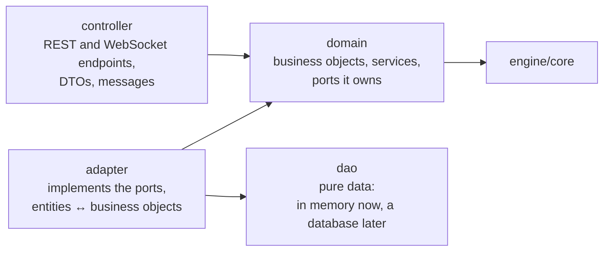

# Shardbound

An invented 1v1 trading card game, built as a testbed for AI engineering: a rules Arbiter with RAG and LoRA, an MCP coach agent, AI opponents, and a rigorous evaluation bench.

Why an invented game? A large language model cannot know its rules. Every correct answer has to come from retrieval or fine-tuning, so the measurements stay honest. And the rules engine computes the ground truth (the exact outcome and the rules applied), so answers are graded against facts, not against another model's opinion.

The game is the pretext; the evaluation is the product. The full plan is in [`docs/design.md`](docs/design.md).

## Status

The foundations come first, and they are what exists today:

- **Rules and content**: a complete rulebook with stable rule IDs ([`docs/rules/`](docs/rules/README.md)), 30 cards and a token, two starter decks, all checked by content tests.
- **Rules engine** (`engine/core`): plays full games with a rule trace, player views that hide what a player may not see, a scenario service, and a random bot. Some cards wait for effects and keywords still to come.
- **Game server** (`engine/api`) and a minimal **Angular client** (`frontend/`): play against a bot or another human in the browser.

Next: the remaining effects and keywords, a greedy bot, then the AI work (roadmap in [`docs/design.md` §11](docs/design.md)).

## Repository

| Path | What |
|---|---|
| `docs/` | Design document and rulebook |
| `content/` | Cards and decks as JSON, with their schemas and tests (Python) |
| `engine/core` | The rules engine: Java 21, no framework |
| `engine/api` | The game server: Spring Boot, REST and WebSocket |
| `frontend/` | The test client: Angular |
| `specs/` | Implementation specs |

## Backend architecture

The backend has two Maven modules, so the boundary between them is enforced at compile time.

**`engine/core` is a pure library.** It holds the rules and nothing else: no Spring, no I/O beyond loading the content. A game state is immutable. `apply(state, action)` returns the new state and the events that led to it, each event carrying the IDs of the rules applied. The engine lists every legal action; a player, human or bot, answers with the index of one of them. The same API serves the game server, the bots, the scenario service that computes the Arbiter's answer keys, and later the tree search.

**`engine/api` is the game server**, in four layers that only call downwards:



- The **domain** knows neither persistence, nor transport, nor JSON. It defines what it needs as ports (`GameSessionPort`, `GameNotificationPort`), and the adapter layer implements them on the DAOs.
- An ArchUnit test checks these dependencies at every build.

**Built for several instances.** Cloud Run can send two messages of one game to two different server instances, so no instance keeps a game in memory:

- every move loads the game, applies it, and saves it with an optimistic lock (a version number);
- a tiny notification then tells every instance "game X is at version n";
- each instance sends its own players what they missed, read from an outbox saved with the game.

A test plays full games across two instances that share one store.

**Clients see only what they may see.** Each player receives their own view and the events redacted for them. Prompts and button labels come from the engine, so the client renders and clicks but never computes a rule.

## Run it

```bash
cd engine && ./mvnw verify                          # build and test the engine and the server
cd engine && ./mvnw -pl api -am spring-boot:run     # the game server on http://localhost:8080
cd frontend && npm install && npm start             # the client on http://localhost:4200
```

Java 21 and Node 24 are enough: the Maven Wrapper downloads Maven.

## Built with coding agents

The project is developed with Claude Code: the specs, the rulebook and the [skills](.claude/skills/) it works from are in the repository, and commits made with it say so.
