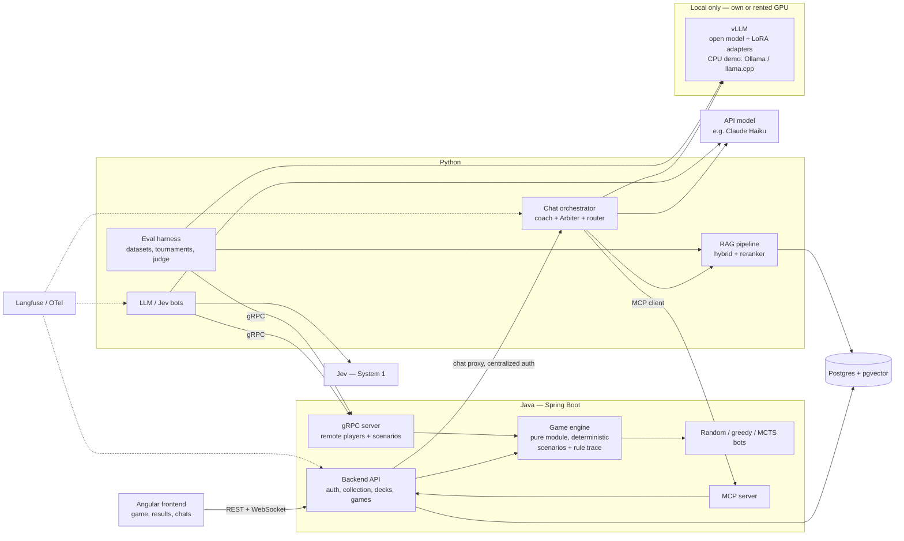

# Shardbound — AI / Agent Engineer portfolio project

> An invented trading card game, and a whole AI ecosystem around it:
> an agentic coach plugged in through MCP, a rules Arbiter built with RAG and LoRA,
> AI opponents (MCTS, and Jev + LLM), and an evaluation bench that rigorously compares every approach.
> Backend and engine in **Java**, AI layer in **Python**, frontend in **Angular**.
> Online demo with zero AI cost; the Arbiter is tested locally.

> **Changelog**
>
> **v2 (October 2026)** — main changes after review:
> - Foundations first: settled rules (§2.5), an engine whose API is designed for its four consumers (§3.4), a small test frontend. The deck builder and the polished frontend come after the AI work (§11).
> - The engine traces the rules it applies: the Arbiter's verdict, citations and steps are checked automatically. The judge only grades form (§6.3).
> - Statistical rigor: 3 seeds per adapter, confidence intervals, paired tests (§6.3).
> - The balance patch retrains nothing. LoRA learns how to arbitrate, not the cards (§5.2, §6.4).
> - MCTS with determinization, so it cannot cheat with hidden information. It is also the opponent in the online demo (§6.5).
> - No GPU online: a site with precomputed results and an answer comparator; the Arbiter runs locally (§8).
> - `frontier+rag` renamed to `api+rag`.
>
> **v2.1 (October 2026)** — game rules settled and written in the [rulebook](rules/README.md), one file per section. Section 2 below is only a summary: when they disagree, the rulebook wins.
>
> **v2.2 (October 2026)** — the project is open source: all repository content is in English. Project knowledge for Claude Code lives in `.claude/skills/`.
>
> **v2.3 (October 2026)** — card format defined in [`content/cards/`](../content/cards/README.md): one JSON file per card with a stable id, rules text generated from the data, game versions as git tags.
>
> **v2.4 (October 2026)** — faction identities set (Ember = attack, Tide = buffs and debuffs, Root = summoning), number scale adopted, first batch of 11 cards + 1 token.
> 
> **v2.5 (October 2026)** — second batch of 19 cards (30 cards + 1 token in total), deck format in [`content/decks/`](../content/decks/README.md) with two 30-card starter decks, Ember vs Root. Content tests run in CI.
>
> **v2.6 (October 2026)** — engine architecture decided: `engine/core` (domain, immutable state, no Spring) and `engine/api` (Spring Boot), REST for resources and a WebSocket protocol for live games, a minimal Angular `frontend/`. Implementation spec: [`specs/phase-2-engine.md`](../specs/phase-2-engine.md).
>
> **v2.7 (October 2026)** — rules clarified for the engine with the maintainer: 19 new rules (1.6, 3.8, 6.8, 6.9, 7.9, 7.10, 8.15–8.22, 9.11, 10.5, 10.6, 11.1.10, 11.2.7), and two rules reworded: Freeze lasts the current turn and the next one (8.10), and the non-active player also makes the choices effects ask of them (5.5.2). List in [`rules/12-open-points.md`](rules/12-open-points.md).

---

## 0. Glossary (read first)

| Term | Meaning in this project |
|---|---|
| **Engine** | Applies the rules, lists legal moves, resolves actions. It never decides anything. It is the project's **single source of truth**. |
| **Bot** | An artificial player: it picks a move among the legal moves provided by the engine. `random`, `greedy`, `mcts`, Jev and LLM are all bots. |
| **Tournament** | A series of N games between two bots (`simulate_matches`, round-robin Elo). |
| **MCTS** | *Monte Carlo Tree Search*. A bot that, to choose **one** move, simulates hundreds of imaginary games and keeps the move with the best win rate. |
| **Determinization** | Replacing hidden information (opponent's hand, deck order) with a plausible guess before simulating. Prevents MCTS from cheating. |
| **HP / Defense** | **HP**: a player's hit points. **Defense**: a unit's hit points. |
| **Coach** | Agentic chatbot that acts on the app through MCP (collection, decks, simulations). |
| **Arbiter** | Chatbot that answers rules questions, like an official rules referee at a tournament. Exists in several versions (RAG, LoRA, RAG + LoRA…) compared by the evaluation matrix. |
| **LoRA Arbiter** | Version of the Arbiter whose model was fine-tuned with a LoRA adapter. |
| **Answer key** | Reference answer computed by the engine: exact final state + trace of the rules applied. |
| **Judge (LLM-as-judge)** | Evaluation only: a large model called through an API, **not trained**, given a grading rubric, the question, the engine's answer key and the Arbiter's answer. It grades the Arbiter, **never the engine**. Unrelated to the Arbiter itself. |
| **System 1 / System 2** | Architecture of the AI opponent: fast decisions (Jev) / strategic planning (LLM). |
| **RAG** | A retrieval step **before** calling the model: relevant passages are fetched and added to the prompt. The model is not modified. RAG involves no training. |
| **LoRA** | Fine-tuning that trains small matrices grafted onto the model's weights. Requires access to the weights. The project's variants (knowledge, RAFT, format) use the same technique: **only the training data changes**. |
| **RAFT** | *Retrieval-Augmented Fine-Tuning* (Berkeley, 2024): LoRA trained with retrieved context that includes misleading passages ("distractors"). |
| **Seed** | The random seed of a training run (matrix initialization, example order, dropout). Two different seeds give two slightly different adapters. |
| **`api+rag`** | Reference configuration: a commercial model called through an API (e.g. Claude Haiku) with the same RAG pipeline as the others. Acts as the ceiling. |

---

## 1. Pitch

Shardbound is a 1v1 card game with its own cards, keywords and interaction rules. It is not meant to be a commercial game: the game is a **testbed** to demonstrate the core skills of an AI engineer.

What the repository demonstrates:

- **Agentic AI**: a coach that acts on the app through an MCP server (collection, decks, simulations), and can consult the Arbiter as a tool.
- **RAG**: an Arbiter that answers rules questions from the rulebook and the card texts.
- **LoRA fine-tuning**: an open model specialized to arbitrate in a strict format. It learns how to arbitrate, not the cards.
- **Rigorous evaluation**: ground truth computed by the engine, quantified comparison of Base / RAG / LoRA / RAG+LoRA / RAFT against a reference API model, with confidence intervals.
- **AI opponents**: an MCTS in Java (the online demo's opponent) and a System 1 / System 2 architecture (Jev + LLM), ranked by Elo.
- **A justified polyglot architecture**: Java where computation and business logic matter, Python where models are called and evaluated.
- **A frugal online demo**: precomputed evaluation results, an answer comparator and games against the algorithmic bots, with zero AI cost. The Arbiter is tested locally.
- **Agentic development workflow**: the app is built with coding agents, and evals are wired into CI.

Why an invented game? Because a base LLM **cannot know** the rules. Every correct answer must come from RAG or LoRA, which keeps the measurements honest. The game also allows "balance patches", perfect for testing knowledge freshness.

---

## 2. The game

**Principle: no clear rules, no game.** Every rules ambiguity becomes noise in the evaluation. The engine is the reference specification, and the rulebook is checked against it by tests.

**The complete rules live in the [rulebook](rules/README.md)** (`docs/rules/`, one file per section), with a stable identifier per rule. This section is only a summary.

### 2.1 Core rules (summary)

- 2 players, 50 **HP** each (also the maximum). Units have **defense** instead.
- 30-card deck: a single faction + neutral cards, at most 2 copies of a card. Opening hand of 5 cards, one mulligan allowed.
- **Information**: each player knows the opposing **faction**, but neither the opposing decklist nor hand.
- Resource: **Shards**. +1 max Shard per turn (cap 10). Shards pay for playing cards **and** for attacking.
- Board: up to 6 units and 3 relics. Hand: up to 10 cards.
- Card types: **Units** (defense + one or two attack abilities, each with its own cost), **Spells** (immediate effect), **Relics** (permanent abilities, cannot be attacked).
- **Combat**: once per turn, a unit attacks by paying the cost of one of its attack abilities. A targeted attack hits an enemy unit; the player can only be attacked when they have no unit left. Some attacks have no target and only buff their own side. The defender can **intercept**: redirect the attack to another of their units. No retaliation. Spells, however, can target the player directly.
- During the opponent's turn you play no cards: you can intercept, and you make the choices that effects ask of you (an echo's target, a discard).
- **Victory**: bring the opponent to 0 HP. An empty deck does not lose the game, but each draw from an empty deck deals increasing **fatigue** (1, 2, 3… HP). Technical limit: the game is a draw after 50 turns per player.

### 2.2 Factions (3 + neutral)

| Faction | Identity | Play style |
|---|---|---|
| Ember | Fire, sacrifice | **Attack**: high damage, direct damage to the player, sacrifice |
| Tide | Water, manipulation | **Buffs and debuffs** |
| Root | Nature, growth | **Summoning**: tokens and sturdy units |
| Neutral | — | Utility cards, playable in any deck |

Target: **~80 cards** at launch, described in JSON validated by a **JSON Schema** (single source of truth for the Java engine, the docs and the Python datasets).

### 2.3 Invented keywords (where LLMs struggle)

*Summary; full definitions in the rulebook's keyword files (`docs/rules/11-*.md`).*

- **Echo X**: a passive of an attack ability. When the unit dies (not when it is returned to hand), that attack is replayed for free at X% of its power. An echo cannot be intercepted. X can exceed 100 (Echo 300). Echo chains are possible.
- **Fracture N**: a spell in N steps (2 to 5), each with its own cost and effect. Each time it is played, it applies the next step and returns to hand. The current step is not displayed: the opponent has to remember it.
- **Anchor**: until the start of its controller's next turn, the unit cannot leave the board. If it drops to 0 defense, it becomes doomed and is only destroyed at the end of that turn, unless it was healed.
- **Overcharge**: optional. The card costs 2 Shards less, but 2 Shards are locked on the next turn. Stackable.
- **Link**: created by neutral spells, between any two units, allied or enemy. Linked units share damage (half rounded up for the unit that was hit). One link per unit; it breaks when either unit leaves the board.

**Interactions** between keywords (e.g. a unit *Linked* to an *Anchored* unit hit by a destruction spell) naturally produce hard multi-step questions, ideal for evaluation.

**Naming note.** Keyword names should not collide with known games' keywords when the meaning is close, or a base LLM brings in its prior. "Overcharge" was chosen over "Overload" for that reason (Hearthstone's Overload is very close). "Echo" exists in Magic with a different meaning: worth watching in the evals (prior interference).

### 2.4 Content deliverables

- `content/cards/<faction>/<slug>.json`: one file per card, with a stable id (`ember.ash-warden`), validated by `card.schema.json`. The rules text is generated from the data with `text-templates.json`, never written by hand. See [`content/cards/README.md`](../content/cards/README.md).
- `docs/rules/`: the rulebook in Markdown (partly generated from the JSON, partly written). Each rule has a stable identifier (e.g. `11.3.2`), reused by the engine's trace.
- `content/decks/<id>.json`: decks (card ids + counts), validated by `deck.schema.json` and by tests of the deck-building rules. See [`content/decks/README.md`](../content/decks/README.md).
- `docs/rulings/`: FAQ of edge cases ("rulings"), as in real TCGs.
- `docs/patches/`: patch notes. Each game version is a git tag (`patch-1.0`, `patch-1.1`…).

**Each ruling has three uses, from a single source:**

1. documentation (edge-case FAQ);
2. a JUnit test of the engine;
3. an evaluation question, with its answer key computed by the engine.

### 2.5 Rules questions

The open questions of v2 are settled in the rulebook. Anything still open or only proposed is listed in [`rules/12-open-points.md`](rules/12-open-points.md). The number scale for cards is a design guideline in [`content/cards/README.md`](../content/cards/README.md); cards that turn out unbalanced are fixed through patches.

---

## 3. Architecture

### 3.1 Language split principle

> **What is compute-intensive or carries business logic goes to Java. What calls or evaluates models goes to Python.**

| Component | Language | Rationale |
|---|---|---|
| API, auth, collection, decks, boosters | Java (Spring Boot) | Classic business logic, credible in an enterprise context |
| Game engine | Java (pure module, no Spring) | Typed modeling (records, sealed interfaces, exhaustive pattern matching); embedded directly by the backend for human vs bot games |
| Random / greedy / MCTS bots | Java (inside the engine) | MCTS simulates hundreds of games per decision: this is where speed matters. It is also the online demo's opponent, at zero AI cost |
| MCP server | Java (official MCP SDK / Spring AI) | Thin layer over existing services, same process as the backend |
| Engine ↔ remote players contract | Protobuf / gRPC | One contract, code generated for Java and Python |
| Chat orchestrator, router | Python | Agentic ecosystem, Jev integration (langchain-typesafe) |
| RAG | Python | The served pipeline and the evaluated pipeline must be **the same** |
| LoRA (training + serving) | Python | Unsloth / PEFT / vLLM |
| LLM and Jev bots | Python | One API call per decision: the network hop to the engine is negligible compared to model latency |
| Eval harness, datasets, tournaments | Python | Evaluation and analysis ecosystem |
| Frontend | Angular | Consistent with a Java profile, RxJS fits the game WebSocket stream. Small test frontend first, polished frontend later |

**What Java performance really brings (and what it doesn't)**:

- Games played by **algorithmic** bots (random, greedy, MCTS) run entirely inside the engine, with no network round trip: a few milliseconds per game (more for MCTS, depending on its thinking budget). This is the default mode of `simulate_matches`.
- Games played by **model-based** bots (Jev, LLM) are bound by API latency and cost, whatever the engine's language. They are reserved for tournaments run as manual or nightly jobs, with a capped number of games.
- The performance benefit therefore rests mostly on **MCTS**, which is the reference baseline in the Elo ranking. Without MCTS, a Python engine would be defensible; the engine stays in Java mainly for typed modeling and because the Java backend embeds it directly.

### 3.2 Diagram



### 3.3 Detailed stack

| Layer | Choice | Notes |
|---|---|---|
| Backend language | Java 21 (LTS) | Records, sealed interfaces, pattern matching, virtual threads |
| Java build | Maven multi-module with the Maven Wrapper | `engine/core` (domain, no Spring) and `engine/api` (Spring Boot); a `repository` module later |
| Backend | Spring Boot | REST, WebSocket, security, JPA |
| Game engine | Pure Java, no framework dependency | Deterministic (seed), lists **legal actions**, emits the **rule trace** |
| MCP | Java MCP SDK / Spring AI MCP Server | HTTP transport, called by the Python orchestrator |
| Cross-language contract | Protobuf + gRPC (generated with `buf`) | Bidirectional streaming for remote players |
| Database | Postgres + pgvector | One database for business data and embeddings |
| Migrations | Flyway | Java side, owns the business schema |
| Frontend | Angular (standalone components, signals) + Tailwind | Small test frontend, then board, deck builder, chat panels, results pages |
| Python services | FastAPI, dependencies managed with `uv` | AI service exposed to the backend |
| RAG | BM25 + embeddings + reranker | Chunking per rule / card / ruling |
| LoRA | Unsloth or PEFT (QLoRA) | Open model from 1.5B to 8B depending on available VRAM |
| LoRA serving | vLLM (local) | Multi-LoRA on a single base model, for evaluation |
| Local demo mode | Ollama or llama.cpp | Small quantized model + LoRA adapter, runs without a dedicated GPU |
| API model | Claude Haiku (or equivalent) | Coach, bot's System 2, `api+rag` reference |
| Judge | API model from a **different family** than the `api+rag` model | Avoids self-preference bias |
| Fast decisions | Jev (TypeSafe AI) | Behind an abstract interface, with a fallback |
| Observability | Langfuse + OpenTelemetry | End-to-end Java ↔ Python traces |
| Tests | JUnit 5 + AssertJ (Java), pytest (Python), Playwright (frontend, optional) | Rulings are JUnit tests |
| Local infra | Docker Compose | `docker compose up` must be enough |
| Deployment | Static site + Google Cloud Run CPU (scale to zero) | No GPU and no model call online |

### 3.4 The player protocol and the engine API (architectural keystone)

The engine does not know **who** is playing. It exposes a single protocol:

1. The engine sends the **state** (the player's view) + the list of **legal actions**.
2. The player answers with the index of the chosen action.

A human in the browser, the Java MCTS and the Python Jev bot are all "players" plugged into this same protocol:

- **local** players (Java bots): direct method call through a `Player` interface;
- **remote** players (Python bots): bidirectional gRPC stream;
- **human** players: WebSocket through the backend.

**The engine API is designed for its four consumers, not for the frontend.** If it only served the frontend at first, part of it would have to be rewritten later. It is done when it serves these four uses:

| Consumer | Needs |
|---|---|
| Frontend (human) | Player view, legal actions, play an action, event stream |
| Bots (player protocol) | The same protocol: player view + legal actions → index of the chosen action. The view includes the **history of public events**, so a bot can remember what it has seen (e.g. the step of a Fracture) |
| Scenario service (evaluation) | A board + a sequence of actions → exact final state + **trace of the rules applied** |
| MCTS | Clone a state; generate a plausible full state from a player's view (determinization, §6.5) |

**The rule trace.** At each resolution step, the engine emits an event carrying the identifier of the rule applied, for example `[11.3.2 Anchor] Root Sentinel cannot leave the board`. This trace is the answer key for the Arbiter's citations and step order (§6.3), and it makes debugging the engine easier.

The **scenario service** lets the Python dataset generator get the **computed ground truth** for interaction questions, instead of having an LLM write it.

---

## 4. Model choices

### 4.1 RAG vs LoRA: what changes technically

- **RAG**: a retrieval step that happens **before** the model call. Relevant passages are fetched (vector search + BM25 + reranking, not just a vector database), pasted into the prompt, and the whole is sent to the model. The model is not modified: **any model works**, open or closed, local or through an API.
- **LoRA**: small matrices grafted onto the model's weights are trained. The weights are needed **at training time** (to compute the matrices) and **at inference time** (to load the adapter next to the base model). Hence an **open-weights model is mandatory**. Impossible with Claude Haiku, whose weights are not public.
- The real distinction is not "local vs API" but **"who holds the weights"**. A LoRA model can perfectly well be called through an API, as long as that API is served by someone who holds the weights: you (vLLM on your GPU), or a provider willing to host your adapter.

Analogy: RAG is letting the student open the book during the exam; any student can do it. LoRA is making the student study before the exam; you need access to their brain. RAG + LoRA is the student who studied the method and also has the book open.

Resulting rule: **we only host a model ourselves if we modify its weights.** Everything that goes through the prompt, RAG or tools works with a standard API model.

### 4.2 Two tiers of models

**Experimental tier — a single open model for the whole matrix.**
To isolate the effect of a technique, only one thing varies at a time: same base model, same prompt, same test set. Only the context (RAG or not) and the weights (LoRA adapter or not) change. Otherwise we measure the difference between two models, not between two techniques.
Candidates: open models from 1.5B to 8B (Qwen, Llama families, or small distilled DeepSeek versions; the large DeepSeek models are far too heavy for LoRA at this scale). Final choice at project start.

**Reference tier — an API model.**
A model like Claude Haiku serves three purposes:

- the **MCP coach** (tool-call reliability is the strength of large models, and small open models are noticeably weaker at it);
- the AI opponent's **System 2**;
- the **`api+rag`** reference configuration of the matrix, which acts as the ceiling.

The most interesting question of the project follows: **does a small open model with LoRA + RAG get close to Haiku + RAG, and at what cost and latency?**

| | Small model | API model |
|---|---|---|
| Model | 3B, open | Haiku |
| LoRA | Yes, trained by us | No, impossible |
| RAG | Yes | Yes, the same pipeline |
| Hosting | Local | Paid API |

LoRA is only applied on one side, on purpose: the question is whether fine-tuning lets a small model catch up with a large model that only has RAG.

### 4.3 Who needs a GPU?

| Component | Model | Weights modified? | Hosting |
|---|---|---|---|
| MCP coach | API (e.g. Haiku) | No | Regular API call (local only) |
| RAG Arbiter | API or open model | No | Regular API call |
| **LoRA Arbiter** | Open model + adapter | **Yes** | **Local**: own (or rented) GPU for training and evaluation; quantized model on CPU for the demo |
| RAG + LoRA Arbiter | Open model + adapter | **Yes** | **Local**, same |
| Bot's System 2 | API | No | Regular API call |
| Bot's System 1, router | Jev | No | TypeSafe API |
| Judge (evaluation) | API, different family | No | Regular API call |

**Only the LoRA Arbiter needs a GPU, and only locally.** Nothing is served on a GPU online (§8).

---

## 5. AI modules

### 5.1 The coach (MCP agent)

The coach knows nothing about the game and does not need to: **all knowledge comes from the tools, all validation comes from the Java engine**. The model only brings reasoning and action sequencing. That is why a standard API model is enough, without fine-tuning.

The coach runs locally (API key required): it is not exposed in the online demo.

MCP tools exposed by the Java server:

| Tool | Description | Risk |
|---|---|---|
| `search_cards` | Search by faction, cost, keyword, text | Read |
| `get_collection` | Cards owned by the user | Read |
| `create_deck` / `update_deck` | Create or modify a deck. The backend rejects an illegal deck with an explicit error, which the coach fixes | Write |
| `delete_deck` | Delete a deck | **Destructive** |
| `simulate_matches` | Run N games deck A vs deck B. **Greedy or MCTS bots by default** (fast, free, reproducible); Jev/LLM bots optional, capped at a small N | Compute |
| `get_match_stats` | Win rate, Shard curve, key cards | Read |
| `open_booster` | Open a booster (virtual currency) | Write |
| `ask_rules` | Ask the RAG Arbiter a rules question | Read |

Typical loop for "Build me an aggressive Ember deck":

1. `get_collection` → which cards the user owns.
2. `search_cards` → read the low-cost Ember and neutral cards.
3. `ask_rules` if a synergy is unclear ("does Link work well with Echo?").
4. `create_deck` → on a legality error, fix and retry.
5. `simulate_matches` against the reference deck, read the stats, adjust.

The `ask_rules` tool makes the Arbiter **a tool of the coach**: a demonstration of agent composition, with no extra hosting.

**Guardrail**: destructive tools are statically flagged (MCP annotation `destructiveHint`) and require user confirmation before running. Since the tool list is known, a static rule is more reliable than a classifier. Optionally, Jev (*noul* mode, §5.4) detects a tool call the user did not explicitly ask for.

### 5.2 The Arbiter

In real TCGs, a rules referee settles rules disputes at tournaments. Here, the Arbiter is a chatbot: the player asks it a rules question, and it answers by citing the rules.

Example question: "On my last turn, I played my Root Sentinel, which has Anchor, and linked it to my Bramble Warden. During their turn, my opponent casts Tempest, a neutral spell that destroys all units. What happens?"

Expected answer, in a fixed format:

```
Rules cited: 11.3.1, 11.3.2, 11.3.3 (Anchor), 11.5.3, 11.5.4 (Link)
Resolution:
1. Tempest tries to destroy all units.
2. The Sentinel is protected by Anchor until the start of my next turn:
   it cannot leave the board. Only that part of Tempest is ignored;
   the rest of the spell applies.
3. The Warden is destroyed. It is linked to the Sentinel, but Link only
   shares damage, not destruction.
4. The Warden left the board: the link is broken.
Verdict: the Warden is destroyed, the Sentinel stays on the board and is no longer linked.
```

*In v1 this example was inconsistent: without a response window, Anchor never protected during the opponent's turn, and the deck mixed two factions. With the settled rules, the original situation becomes valid.*

The Arbiter exists in several versions, and **this is exactly what the evaluation matrix compares** (§6.2).

**RAG version**: answers from `docs/rules`, `docs/rulings` and the card texts.

- **Semantic** chunking: one rule = one chunk, one card = one chunk, one ruling = one chunk.
- Metadata: patch version, faction, keywords involved.
- Hybrid BM25 + embeddings search, then reranking.
- Answers must be **sourced** (rule / card identifier cited).
- Explicit refusal when the answer is not in the docs.

**LoRA versions.**

**Principle: LoRA learns the mechanics and how to arbitrate, not the cards.** Card content arrives through the context (RAG), so changing a card does not break the adapter. LoRA-knowledge is the deliberate counter-example, there to show why memorizing cards is a bad idea.

What fine-tuning should teach:

- always cite the rules;
- break the resolution down step by step, following the order in which effects apply;
- end with a clear verdict, in the format above;
- sound like an official referee.

Three adapters, trained on the **same base model**, with the **same technique** and the **same hyperparameters**. Only the training data changes:

| Adapter | Training data | What it learns | Analogy |
|---|---|---|---|
| **LoRA-knowledge** | Question → answer, no context | Memorize rules and cards in its weights | The student who learns the book by heart |
| **LoRA-RAFT** | Question + retrieved passages (the right one + distractors) → answer citing the right passage | Use the context and ignore noise | The student who practices open-book exams with fake pages slipped in |
| **LoRA-format** | Answers in the strict format (citations, steps, verdict, tone) | The form; facts come from RAG | The student who learns how to write the answer sheet |

What the matrix reveals: if `lora-format+rag` does almost as well as `lora-raft+rag`, the gain from fine-tuning comes mostly from the format, not from understanding. That would be a real finding.

Each adapter is trained **3 times** (seeds 1, 2, 3), see §6.3.

### 5.3 AI opponents

Two families of bots, plugged into the same player protocol (§3.4):

- **algorithmic, in Java**: `random`, `greedy`, `mcts`. MCTS is the **online demo's opponent**: strong, fast and free;
- **model-based, in Python**: `llm-only`, `jev-only`, `jev+llm`. Because of their cost, they stay local and in tournaments.

**System 1 / System 2** architecture of the model-based bots, connected to the Java engine through gRPC:

- **System 2 (API LLM)**: at the start of a turn, analyzes the game state and produces a short **plan** ("I'm behind, I need to stabilize the board and keep my board-clear spell").
- **System 1 (Jev)**: for each decision, the engine sends the **legal actions**; Jev receives the state + the plan and picks through a *choice* question. Probabilities and confidence are logged.
- **Escalation**: if Jev's confidence is below a threshold, the LLM is called again for that specific decision.

Key advantage: the engine only offers legal moves, so there are **zero illegal moves**, unlike an LLM playing in free text.

Additional uses of Jev during a game:

- *score* questions: "how favorable is this position?" → advantage curve shown live in the UI.
- *noul* questions: "should I mulligan?", "should I intercept this attack?".

**Jev's scope**: it only concerns the AI opponent and a few peripheral pieces (§5.4). The Arbiter, RAG, LoRA and the judge do not depend on it.

**Watch out**: Jev is a very recent proprietary model (launched mid-September 2026). It sits behind a `DecisionModel` interface with a fallback implementation (LLM with structured output, or a small local classifier), so the project stays usable without an API key.

### 5.4 Jev elsewhere in the project (peripheral, all replaceable)

- **Unified chatbot router**: *choice* question → `coach` / `arbiter-rag` / `arbiter-lora` / `arbiter-rag+lora` / `off_topic`. Replaceable by an LLM with structured output.
- **MCP guardrail (optional)**: *noul* "was this tool call explicitly requested?", on top of the static annotation (§5.1).
- **RAG relevance filter**: *noul* "does this chunk help answer the question?" → compared with a classic reranker (experiment 5, §6.4).

### 5.5 Unified chatbot

A single entry point that routes to the right module. It is the final demo, **run locally** (API costs). The Angular frontend talks to the Spring backend, which handles authentication and forwards to the Python AI service.

---

## 6. Evaluation protocol

This is the most important part of the repository for a recruiter.

### 6.1 Datasets

Generated semi-automatically from the card JSON, the rules and the rulings. For interaction and multi-step questions, the **answer key is computed by the Java engine's scenario service**: exact final state + trace of the rules applied. A subset is **checked by hand** (≥ 150 annotated questions).

| Question type | Example | Target volume |
|---|---|---|
| Factual | "How much does Ash Warden cost?" | 200 |
| Simple rule | "What does Overcharge do?" | 150 |
| Interaction | "What happens if a unit Linked to an Anchored unit is hit by Tempest?" | 200 |
| Multi-step | A sequence of 3 actions with chained Echoes | 100 |
| Unanswerable | A question about a mechanic that does not exist | 100 |
| Deck building | "Is this deck legal?" | 50 |

Strict rules: train / test split without leakage (no card or interaction shared between train and test multi-step questions), fixed seed, versioned datasets.

### 6.2 Arbiter configuration matrix

All configurations except the last one use **the same open base model** (§4.2). Each LoRA configuration is evaluated on its 3 adapters (one per seed).

| Config | Description |
|---|---|
| `base` | Base model, no context |
| `base+rag` | Base model + RAG |
| `lora-knowledge` | LoRA-knowledge, no context |
| `lora-knowledge+rag` | LoRA-knowledge + RAG |
| `lora-raft+rag` | LoRA-RAFT + RAG |
| `lora-format+rag` | LoRA-format + RAG |
| `api+rag` | API model (e.g. Haiku) + the same RAG — reference ceiling |

### 6.3 What we measure, and how

**Principle: whatever the engine can check, it checks. The judge only grades form.** The engine remains the single source of truth; the judge grades the Arbiter's answer with the engine's answer key in front of it.

| Part of the Arbiter's answer | How it is checked |
|---|---|
| Verdict | **Automatic**: compared with the final state computed by the engine |
| Rules cited, step order | **Automatic**: compared with the engine's rule trace |
| Format compliance | **Automatic**: parser |
| Tone, clarity | **Judge** (LLM-as-judge) |

**The judge**: a large model called through an API, not trained, with an explicit rubric. It is **calibrated** against human annotations (judge / human agreement published) and chosen from a **different model family** than the `api+rag` model, to avoid self-preference bias.

**Other metrics**:

- **Recall@k** and **MRR** of retrieval.
- **Faithfulness** to the context.
- **Correct refusal rate** on unanswerable questions / **hallucination rate**.
- **Latency** p50 / p95 and **cost** per request.

**Statistical rigor**:

- **3 seeds per adapter.** Training involves randomness: two identical runs with different seeds can differ by a few points. Without several seeds, there is no way to tell whether a 2-point gap comes from the method or from luck. We publish the mean and the spread.
- **Confidence intervals** by bootstrap: with 100 to 200 questions per category, they span several points.
- **Paired tests** (McNemar): all configurations answer the same questions.
- **Temperature 0** at inference.

### 6.4 Headline experiments

Reading criterion: **do we already know the answer?** Experiments with a predictable outcome serve as baselines or visuals; those with an open outcome are the project's real contributions.

| Experiment | Outcome | Main interest |
|---|---|---|
| 1. Balance patch | Largely predictable | Very visual, perfect for the README |
| 2. Robustness to distractors | Open | A new result |
| 3. Model size | Open | Size vs technique trade-off |
| 4. Small model vs API model | Open | The question companies ask |
| 5. Reranker vs Jev | Open | Cost and latency comparison |

Research has already shown that fine-tuning is poor at injecting new facts, much worse than RAG. `lora-knowledge` without RAG will very likely confirm this: it is a useful baseline, not a discovery.

#### 1. The balance patch

After the LoRA adapters are trained, a patch is published that changes 10 cards and 2 rules, then everything is re-evaluated. **Nothing is retrained**: the point is to measure what happens to adapters trained *before* the patch.

| Component | What happens at the patch | Cost |
|---|---|---|
| Engine + JSON | Cards and rules are changed | It is the patch itself |
| RAG | Changed chunks are re-indexed (RAG involves no training) | A few minutes |
| LoRA | **Nothing, on purpose** | None |
| Test questions | The patched engine recomputes the answer keys | Automatic |
| Evaluation | Every configuration (3 seeds each) is re-run on the affected questions, then graded | Inference only |

Hypotheses:

- **`lora-knowledge`** without RAG answers with the old values, frozen in its weights.
- **`base+rag`** adapts immediately.
- **`lora-knowledge+rag`** is the most interesting case: the old value is in the weights, the new one in the context. Which wins? This is a knowledge conflict, hard to predict.
- **`lora-raft+rag`** should follow the context, since it was trained to.
- **The 2 changed rules**: the format and RAFT adapters saw hundreds of examples applying the old rules, and may have absorbed part of them into their weights. Do they follow the new rule in the context, or the old one?

The experiment is run once or twice, not at every change to the game. For regular patches during the game's life, only RAG is updated.

Lesson for the README: a LoRA that memorizes the cards must be retrained at every patch, which is unsustainable in a company. A LoRA that learns the method, with RAG providing the facts, adapts without retraining.

#### 2. Robustness to distractors

Misleading chunks are deliberately injected into the context. Hypothesis: LoRA-RAFT resists better. RAFT was tested on real documents; the question is whether it holds on invented rules with multi-step interactions.

#### 3. Model size

The same protocol on 1.5B / 3B / 8B. Question: does a small LoRA+RAG model catch up with a large RAG-only model?

Where training happens does not change the result: a 3B trained locally or on a rented GPU gives the same adapter. The variable is the model size; the rented GPU only provides more VRAM for the 8B. It must also be kept for inference on the test set, or the model must be quantized to run locally.

#### 4. Small model vs API model

`lora-raft+rag` (small local model) against `api+rag`. What percentage of the quality, for what cost and what latency? Target conclusion: "X% of the quality, Y times cheaper, Z times slower". This is the question companies ask: can a small model hosted in-house replace a paid API?

#### 5. Reranker vs Jev

Filter chunks with a classic reranker vs with Jev (*noul*). Compare recall, latency, cost.

Results are published as tables + charts in `evals/reports/`, summarized in the README and displayed on the site (§8).

### 6.5 Evaluating the AI opponents

Round-robin tournament between bots, on several decks, with fixed seeds. Orchestrated by the Python harness, played by the Java engine.

| Bot | Language | Description |
|---|---|---|
| `random` | Java | Random legal move (floor) |
| `greedy` | Java | Heuristic: maximizes immediate board value |
| `mcts` | Java | Monte Carlo Tree Search with determinization (reference baseline, online demo opponent) |
| `llm-only` | Python | An LLM that picks among the legal moves, at every decision |
| `jev-only` | Python | Jev alone, without a plan |
| `jev+llm` | Python | Full System 1 / System 2 architecture |

**MCTS and hidden information.**

There are two levels of simulation, not to be confused:

1. the **tournament**: N real games between two bots;
2. **inside each MCTS decision**: hundreds of imaginary games, played with the engine, to compare the possible moves.

To simulate the rest of the game ("I play X, the opponent answers Y, I draw Z"), MCTS needs the opponent's hand and the deck order. The trap: since it runs inside the engine, the easiest path is to clone the internal state, which contains the real opposing hand and the real deck order. The bot then simulates with the hidden cards and **cheats** without anyone intending it. Consequences: its Elo is inflated, every comparison with it is skewed, and it knows the human player's hand in the frontend.

**Countermeasure: determinization.** Before simulating, hidden information is replaced with a plausible guess, then the process is repeated with many different guesses (ISMCTS, *Information Set MCTS*). Since a player only knows the opposing faction (§2.1):

- **known** cards in the opposing hand stay fixed (e.g. a Fracture that returned to hand, with its step);
- the rest of the opposing hand is drawn at random from the cards of their faction and the neutral cards (respecting the 2-copy limit);
- the bot's own deck is shuffled.

**Never clone the raw internal state** in MCTS: it only goes through the engine API's determinization function (§3.4).

**Thinking budget**: MCTS gets a budget per decision (e.g. 500 simulations or 300 ms). Against a human, one second of thinking is perfectly fine.

Metrics: **Elo**, win rate per matchup, **latency per decision**, **cost per game**, number of escalations to the LLM.
The real question the README answers: **how much performance do we keep while dividing cost and latency?**

Budget: games involving model-based bots are the slowest and most expensive. The number of games per matchup is fixed upfront (and justified by a confidence interval on the win rate), and these tournaments run as manual or nightly jobs.

Bonus (optional): distill the `mcts` bot's decisions into a small LoRA model (behavior cloning) and add it to the ranking.

---

## 7. Local training and evaluation

LoRA training and the evaluation matrix run **locally**. It is occasional work, but not one-off:

- several runs are expected (failed first attempts, hyperparameter tuning);
- 3 seeds per adapter, so 3 times the training time: reasonable at 1.5B–3B;
- the patch experiment (§6.4) requires re-running the **evaluation** (not the training) after the docs change.

Indicative VRAM for QLoRA:

| Model size | Recommended VRAM |
|---|---|
| 1.5B – 3B | 8 to 12 GB |
| 8B | ~24 GB |

If the local GPU is limited, stay at 1.5B or 3B: plenty for the demonstration. For the size experiment (8B), or as a last resort, a GPU rented by the second (e.g. RunPod, RTX 4090 around $0.34/h on Community Cloud, September 2026 price to be checked) costs a few dollars per run, training **and** evaluation inference included. Always shut pods down after use.

CI has no GPU: the CI "smoke" eval runs with the RAG Arbiter on an API model, or with a small quantized model on CPU.

---

## 8. Online demo and local demo

### 8.1 Principle: zero AI cost online

No GPU and no call to a model API from the public site. Recruiters see the project and its results without running anything; those who want to try the Arbiter themselves run it locally.

Reminder: most recruiters will not click on the demo. The README GIF, the results tables and the code quality matter more.

### 8.2 The site

| Content | Hosting |
|---|---|
| Precomputed evaluation results (matrix, patch, Elo, costs) | Static (GitHub Pages, Cloudflare Pages…) |
| **Answer comparator**: pick a question and see the answers of all 7 configurations side by side, with the engine's answer key | Static (precomputed answers) |
| Games against the `random` / `greedy` / `mcts` bots (optional) | Java backend on Cloud Run CPU, scale to zero |

The comparator shows the Arbiter at work without running anything: far more telling than a table.

With no user accounts online, **the demo needs no database**. If one is ever needed: a managed Cloud SQL instance stays on permanently and is billed monthly; compare with a serverless Postgres offering (with pgvector) that has a free tier.

Protection, even without AI: per-visitor rate limiting, a cap on concurrent games and a bounded MCTS thinking budget in demo mode, a budget alert on the GCP project.

### 8.3 Local demo (`docker compose --profile demo up`)

- **A GPU-free path is mandatory**: LoRA Arbiter through a small quantized model (Ollama or llama.cpp), or RAG Arbiter through an API with a key provided by the user.
- Coach and unified chatbot available with an API key.
- Evaluation results **already computed and published** in `evals/reports/`.
- **Test the setup on a clean machine.** A recruiter who takes the time to run the project and hits an error is worse than no demo at all.

### 8.4 Later option (outside the roadmap): LoRA Arbiter online

If the LoRA Arbiter ever has to be queryable online:

- **Cloud Run with an L4 GPU** (24 GB), billed by the second, scale to zero. Ballpark: ~$0.67/h in a Tier 1 region (September 2026, to be checked), plus at least 4 vCPU and 16 GB of memory billed on top. Always `min-instances = 0`, `max-instances = 1`, budget alert. Long cold start (vLLM loading the model): small quantized model, weights baked into the image, a "the Arbiter is waking up…" message in the UI.
- **A provider that hosts the LoRA adapter** and bills per token. Terms vary between providers: check when choosing.
- In every case: rate limits and spending caps on API accounts.

---

## 9. Agentic development workflow

Documented in `docs/dev-workflow.md`, with screenshots and real examples.

- `CLAUDE.md` / `AGENTS.md` at the root, plus one per sub-project (`engine/`, `ai/`, `frontend/`) with each ecosystem's commands and conventions.
- **Project knowledge as skills** in `.claude/skills/`: how the rules work, how cards are written, how the architecture fits together. Any contributor using Claude Code gets the same context.
- **Spec-driven**: each feature starts with a spec in `specs/`, implemented by a coding agent, reviewed by a human.
- **PR review agent** in GitHub Actions.
- **Per-ecosystem CI**, triggered by changed paths:
  - Content (in place): card and deck schemas, card and deck rules, text templates (`content/tests/`) on every push or PR touching `content/` (`.github/workflows/content.yml`);
  - Java: Maven build, engine JUnit tests (rules, interactions, **one test per ruling**), backend integration tests;
  - Python: lint, pytest, RAG "smoke" eval (≈ 50 questions, no GPU) on every PR touching `ai/rag/`, `docs/` or `content/` → PR blocked if accuracy drops by more than X points;
  - Proto: gRPC contract compatibility check (`buf breaking`);
  - Frontend: Angular build and tests;
  - Site deployment (static + Cloud Run CPU) on the main branch;
  - Bot tournament as a manual job; full LoRA matrix run locally.
- **Assisted content generation**: one agent proposes new cards, a second agent checks balance through `simulate_matches` (MCTS bots), a human validates.

---

## 10. Repository layout

```
shardbound/
├── CLAUDE.md
├── README.md
├── docker-compose.yml          # profiles: dev, demo (no GPU)
├── .claude/
│   └── skills/                 # project knowledge for Claude Code
├── specs/                      # feature specs (agentic workflow)
├── content/
│   ├── pyproject.toml          # small uv project that runs the content tests
│   ├── cards/                  # card.schema.json, text-templates.json, README.md + <faction>/<slug>.json
│   ├── decks/                  # deck.schema.json, README.md + <id>.json (starter decks)
│   └── tests/                  # card and deck schemas, card and deck rules, text templates
├── proto/                      # shared protobuf / gRPC contracts
├── engine/                     # Maven multi-module (groupId fr.daliush.shardbound), see specs/phase-2-engine.md
│   ├── pom.xml
│   ├── core/                   # the domain, no Spring: rules, legal actions, events + rule trace, views, scenarios, determinization, bots
│   ├── api/                    # Spring Boot: REST (cards, decks, games) + WebSocket game server; later MCP and gRPC
│   └── (repository/)           # later, with Postgres
├── ai/                         # Python (uv)
│   ├── chat/                   # orchestrator, coach, Arbiter, router, MCP client
│   ├── rag/                    # ingestion, retrieval, reranking
│   ├── lora/                   # dataset generation, training (3 seeds), configs
│   ├── serving/                # local serving (vLLM) + CPU demo profile (Ollama / llama.cpp)
│   ├── bots/                   # LLM, Jev, Jev+LLM bots (gRPC clients)
│   ├── decision/               # DecisionModel interface (Jev + fallback)
│   └── service/                # FastAPI service exposed to the backend
├── frontend/                   # Angular: test frontend, then polished frontend, results pages, comparator
├── deploy/                     # static site + Cloud Run CPU (limits, budget)
├── docs/
│   ├── design.md               # this document
│   ├── rules/                  # rulebook: README.md index + one file per section (00-vocabulary.md … 12-open-points.md)
│   ├── rulings/                # rulings = docs + JUnit tests + eval questions
│   ├── patches/
│   └── dev-workflow.md
├── evals/
│   ├── datasets/
│   ├── harness/
│   └── reports/                # precomputed, published results
└── .github/workflows/
```

---

## 11. Roadmap

Solid foundations first, then AI, then the polished app. Each phase produces something presentable on its own; **from the end of phase 4, the portfolio is publishable.**

| Phase | Content | Demo deliverable |
|---|---|---|
| **0. Foundations** | Monorepo, `CLAUDE.md`, skills, Maven multi-module, `uv` project, Docker, per-ecosystem CI | Clean repo, agentic workflow in place |
| **1. Rules and content** | Settled rules (rulebook), first rulings, JSON Schema + first 40 cards (target 80) | Complete, unambiguous rules |
| **2. The engine** | Java engine, API for its four uses (§3.4): player protocol, scenarios + rule trace, cloning + determinization. Rulings as JUnit tests, `random` / `greedy` bots, small test frontend | Game playable in a minimal frontend, fully tested engine |
| **3. The RAG Arbiter** | Hybrid pipeline, dataset generator plugged into the scenario service, eval harness, calibrated judge | RAG Arbiter + first numbers |
| **4. The LoRA Arbiter** | Training datasets, 3 adapters × 3 seeds (locally), full matrix, patch experiment, comparison with `api+rag` | Comparison table RAG vs LoRA vs API model |
| **5. The coach** | Minimal Spring backend (collection, decks), Java MCP server, Python orchestrator, coach on an API model | GIF "build me a deck and simulate" |
| **6. AI opponents** | `mcts` with determinization, gRPC contract, `llm-only` / Jev / `jev+llm` bots, Elo tournament | Elo ranking + cost / latency |
| **7. App and unification** | Polished Angular frontend, deck builder, router, guardrails, evals in CI, end-to-end traces | Complete local demo in 2 minutes |
| **8. Going online** | Static site (results + comparator), games against MCTS on Cloud Run CPU, `demo` profile tested on a clean machine, final README | Site online with zero AI cost |

---

## 12. Risks and mitigations

| Risk | Mitigation |
|---|---|
| The game grows too big | Cap at 80 cards and 5 keywords for v1. The game is a pretext. |
| Ambiguous rules → noise in the evaluation | Rules settled before the engine (rulebook), engine = specification, one JUnit test per ruling. |
| Engine API to be rewritten later | Designed from the start for its four uses (§3.4), not for the frontend. |
| Two ecosystems to maintain (Java + Python) | Clear boundaries, a single protobuf contract, path-triggered CI, one `CLAUDE.md` per sub-project. |
| Data models drifting between languages | JSON Schema for cards, protobuf for the rest, code generation on both sides. |
| RAG / LoRA comparison skewed by different models | Same open base model for the whole matrix; the API model only appears as a reference. |
| Gaps caused by training randomness | 3 seeds per adapter, bootstrap confidence intervals, paired tests. |
| Judge-biased evals (LLM-as-judge) | The engine checks verdict, citations and steps; the judge only grades form, is calibrated against human annotations and comes from a different family than the API model. |
| MCTS cheating with hidden information | Determinization; never clone the raw internal state. |
| Cost and slowness of simulations with model-based bots | Algorithmic bots by default, model-based tournaments capped and run offline. |
| Not enough local VRAM | Stay at 1.5B–3B; a GPU rented by the second as a last resort. |
| Online costs | No AI online: static site + Cloud Run CPU scale to zero, budget alert. |
| Local setup failing for a recruiter | GPU-free path, tested on a clean machine. |
| Dependency on Jev (recent API, access and pricing may change) | Scope limited to the AI opponent and peripheral pieces; `DecisionModel` interface + local fallback; the project runs without a key. |
| Confusing Arbiter and judge in the docs | Glossary (§0); "Arbiter" for the chatbot, "judge" only for evaluation. |
| Train / test leakage | Split by cards and by interactions, checked by a script. |
| Scope creep | Follow the roadmap: finish a phase before starting the next. |

---

## 13. Showcase README (checklist)

- [ ] 20-second GIF at the top: a game against MCTS + the coach chat.
- [ ] Link to the online site (results, answer comparator, games against MCTS).
- [ ] Architecture diagram with the Java / Python / local GPU boundary clearly visible.
- [ ] "Why this language for each component" section (from §3.1).
- [ ] "RAG vs LoRA: who needs the weights" section (from §4.1 and the §4.3 table).
- [ ] "How the evaluation is checked" section: ground truth computed by the engine, rule trace, limited role of the judge.
- [ ] Arbiter matrix results table (3 seeds, confidence intervals), including against the API model.
- [ ] "Before / after patch" chart, with the lesson: LoRA learns the method, not the cards.
- [ ] Bot Elo ranking with cost and latency.
- [ ] "Why no AI online" section (deliberate choice, costs, local demo).
- [ ] "What I learned" section (trade-offs, failures, surprises).
- [ ] "Enterprise transposition" section: the same architecture to plug AI assistants into an existing Java information system.
- [ ] `docker compose --profile demo up` (no GPU) + one command to run the evals.
